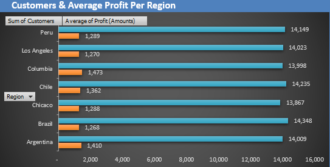

# Kiran's Portfolio

## [Project 1 : Excel Dashboarding](https://github.com/paudel7/Excel-Dash)
**Project Overview** :
The goal of this project is to develop an interactive and informative dashboard to monitor key performance indicators (KPIs) for a sales and profitability analysis across different regions and time periods. This dashboard is designed to provide stakeholders with an easy-to-understand visual summary of critical business metrics such as sales volume, profit, target performance, and customer behavior. By leveraging pivot tables, charts, and visual filters, the dashboard offers insights that can drive data-driven decisions for optimizing sales strategies, improving profitability, and understanding customer dynamics.
 
* Data Collection & Cleansing
* Pivot Table Construction
* Charts & dashboard Creation   

<!-- **Demo Images** -->  

  
 

  
  [For further details please visit the documentation](https://sites.google.com/view/excel-sales-data-analysis) | [For viewing actual worksheet please visit onedrive](https://onedrive.live.com/view.aspx?resid=153FB54B16EC9F47%2121236&authkey=!ACUCjOsJdhewOHM)

<!--**Demo Video** -->

---
## [Project 2 : SQL-Tableau Dashboarding](https://github.com/paudel7/SQL-Tableau-Viz)
**Project Overview** :
The primary goal of this project was to design and implement an end-to-end data visualization solution. This involved leveraging SQL to process and prepare data and Tableau to create interactive and insightful dashboards. The objective was to provide clear and actionable insights into revenue trends and performance metrics across various dimensions, such as time, location, and product categories.
 
* Data Preparation in SQL
* Data ETL in Excel & Validation in Tableau
* Visualization and Dashboard Creation in Tableau   

<!-- **Demo Images** -->  

 

[For further details please visit the documentation](https://sites.google.com/view/sqltableaubikeviz) | [For Tableua please follow the link](https://public.tableau.com/app/profile/paudel7/viz/BikeStoresRevenueAnalysis_17352681173400/Dashboard)

<!--**Demo Video** -->
---
## [Project 3 : Amazon Quicksight (AWS Cloud) Visualization](https://github.com/paudel7/AWS-Quicksight-Analytics)
**Project Overview** :
This project involved analyzing Netflix movie and TV show production data (show_id, title, director, cast, etc.) from 2007 to 2021 by utilizing Amazon QuickSight for data visualization. The process included loading data into an S3 bucket, connecting it to QuickSight, and creating a comprehensive dashboard for visual analysis, enabling better insights into trends and patterns in Netflix's content library.
 
* Utilized S3 and QuickSight for efficient data integration and visualization.
* Created dynamic dashboards with a variety of visualization types and applied filters for deeper analysis.
* Enhanced decision-making through the ability to export, share, and collaborate on dashboards.
  

<!-- **Demo Images** -->  

 
[For further details please visit the documentation](https://sites.google.com/view/aws-quicksight-netflixviz/home?authuser=0&pli=1)) 

<!--**Demo Video** --> 
---
## [Project 4 : SQL Database & Reporting](https://github.com/paudel7/SQL-Operations_Painting)
**Project Overview** :
This project involved leveraging SQL and Python to analyze a rich dataset on paintings, artists, and museums. By loading the data into a MySQL database and executing targeted SQL queries, we answered key business questions regarding museum operations, artist popularity, canvas pricing, and painting styles. The insights obtained provide actionable information on global art trends and operational details of museums.
 
* Conducted data extraction, transformation, and loading (ETL) for 8 datasets into a MySQL database, resolving foreign key constraints.
* Answered 14 key business questions, revealing insights on artist popularity, museum operations, and painting trends.
* Delivered insights such as the most expensive canvas size, the longest-operating museums, and artists with global reach.
  

<!-- **Demo Images** -->  

 [For further details please visit the documentation](https://sites.google.com/view/sql-data-dev-reporting)

  <!--**Demo Video** -->
  
---

## [Project 5 : Python-Streamlit Web Application](https://github.com/paudel7/Python-Streamlit-Webapp)
**Project Overview** :
This Streamlit-based web application is designed to showcase interactive data visualization and analysis tools. The platform allows users to upload earthquake-related CSV files, explore dataset summaries, and generate insightful visualizations such as scatter plots, geographic maps, and statistical summaries. Its intuitive design enhances data accessibility and provides meaningful insights for decision-making.
 

* Enables seamless CSV file uploads for earthquake-related data exploration.
* Offers dynamic visualizations, including scatter plots, geographical maps, and statistical summaries.
* Designed for ease of use, with a navigation menu for interactive data exploration.

 

<!-- **Demo Images** -->  

 <!--**Demo Video** -->

 [For further details please visit the documentation](https://sites.google.com/view/python-streamlit-web-app/home)

---
