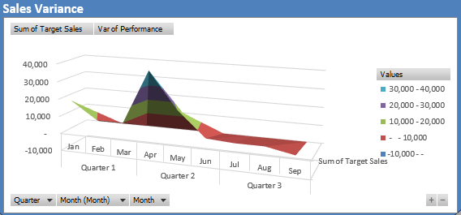

# Kiran's Portfolio

## [Project 1 : Excel Dashboarding](https://github.com/paudel7/Excel-Dash)
**Project Overview** :
The goal of this project is to develop an interactive and informative dashboard to monitor key performance indicators (KPIs) for a sales and profitability analysis across different regions and time periods. This dashboard is designed to provide stakeholders with an easy-to-understand visual summary of critical business metrics such as sales volume, profit, target performance, and customer behavior. By leveraging pivot tables, charts, and visual filters, the dashboard offers insights that can drive data-driven decisions for optimizing sales strategies, improving profitability, and understanding customer dynamics.
 
* Data Collection & Cleansing
* Pivot Table Construction
* Charts & dashboard Creation   

**Demo Images**  

  
 

  
  [For further details please visit the documentation](https://sites.google.com/view/excel-sales-data-analysis) | [For viewing actual worksheet please visit onedrive](https://onedrive.live.com/view.aspx?resid=153FB54B16EC9F47%2121236&authkey=!ACUCjOsJdhewOHM)

<!--**Demo Video** 
NOTE:  -->

---
## [Project 2 : SQL-Tableau Dashboarding](https://github.com/paudel7/SQL-Tableau-Viz)
**Project Overview** :
The primary goal of this project was to design and implement an end-to-end data visualization solution. This involved leveraging SQL to process and prepare data and Tableau to create interactive and insightful dashboards. The objective was to provide clear and actionable insights into revenue trends and performance metrics across various dimensions, such as time, location, and product categories.
 
* Data Preparation in SQL
* Data ETL in Excel & Validation in Tableau
* Visualization and Dashboard Creation in Tableau   

**Demo Images**  

 

<!--  **Demo Video** -->

[For further details please visit the documentation](https://sites.google.com/view/sqltableaubikeviz) | [For Tableua please follow the link](https://public.tableau.com/app/profile/paudel7/viz/BikeStoresRevenueAnalysis_17352681173400/Dashboard)

---
## [Project 3 : Amazon Quicksight (AWS Cloud) Visualization](https://github.com/paudel7/AWS-Quicksight-Analytics)
**Project Overview** :
 
* a
* b
* c   

**Demo Images**  

  **Demo Video** 

[For further details please visit](https://sites.google.com/view/aws-quicksight-netflixviz/home?authuser=0&pli=1)
---
## [Project 4 : SQL Database & Reporting](https://github.com/paudel7/SQL-Operations_Painting)
**Project Overview** :
 
* a
* b
* c   

**Demo Images**  

  **Demo Video** 

[For further details please visit]()
---
## [Project 5 : Python-Streamlit Web Application](https://github.com/paudel7/Python-Streamlit-Webapp)
**Project Overview** :
 
* a
* b
* c   

**Demo Images**  

  **Demo Video** 

[For further details please visit]()
---
